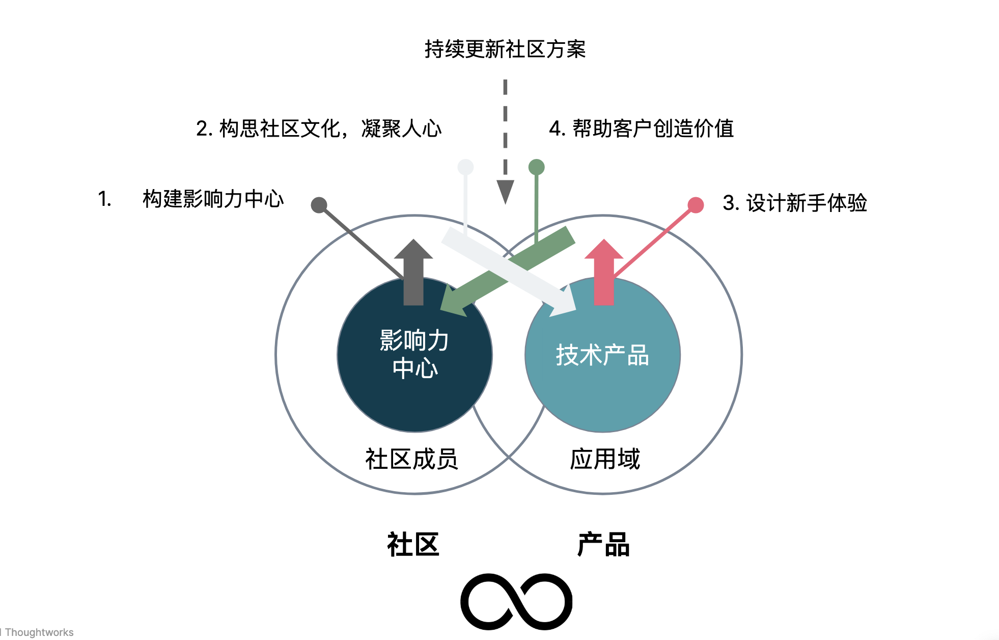
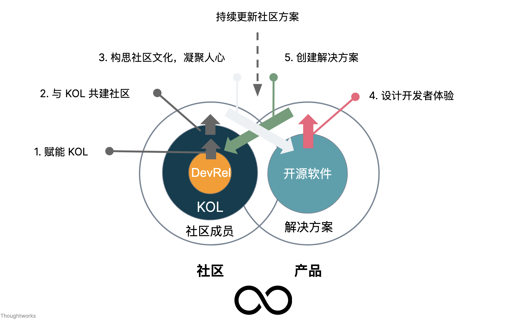

>  技术产品化运营，是将技术产品（如开放 API、开源软件、开放平台、SDK、工具等）视为产品，在组织内部或者外部进行推广，以吸引更多的用户、开发者等参与到其中，加入到技术产品开发中，或者是采用该技术产品在其应用域构建解决方案。

过去的半年里，因为工作的缘故，我需要重复和人们讲述，如何去做好社区？如何去做技术运营？其中有一部分的内容，相当的相似与重复，诸如于：

 - 《[开发者体验 —— 内部工具的“最后一公里”](https://www.phodal.com/blog/developer-experience/)》
 - 《[“内源”文化优于中台思想](https://www.phodal.com/blog/innersource-over-zhongtai/)》
 - 《[开源游戏：开源会为企业带来什么](https://www.phodal.com/blog/developer-experience/)》

内源、内部工具、开源等的推广，位于它们背后的便是：技术的产品化运营。所以，我想写一篇文章来总结一下模式。如此一来，在未来我就可以甩出本文即可。

## 技术产品化运营

与几年前相比，国内与技术产品化运营相关的岗位越来越多，诸如于布道师（Evangelist）、开发者关系（DevRel）、技术运营、开发者运营等。虽然，岗位职责稍有不同，也就是目标 KPI 是不同的。但是呢，其中有相当多的相交之处，诸如于从技术社区出发，去为技术产品（如开源项目、云服务、商业化工具等）带来某一方面的价值 —— 如品牌、销售量等。

基于这一个基本的模式（从社区-产品），我提取了第一版本的『**技术产品化运营元模型**』（请原谅我图画的丑）：

从某种意义上来说，这个领域所做的事情和现在的新媒体运营有点相似。但是，它的强技术背景大大提升了准入的门槛。而如果你也有一定的经验，你可以从上图中的四个步骤，看出产品化运营的困难之处，它涉及到多个领域：技术、社区运营、开源者体验设计、开放式协作等。

### 定义技术产品化运营

 技术产品化运营，是将技术产品（如开放 API、开源软件、开放平台、SDK、工具等）视为产品，在组织内部或者外部进行推广，以吸引更多的用户、开发者等参与到其中，加入到技术产品开发中，或者是采用该技术产品在其应用域构建解决方案。

如上所述，市面上已经有一系列的技术产品化运营的岗位，这些岗位受限于角色定义的不同，所承担的职责也有所不同。如：

1. 布道师（Evangelist）。从语义上来定义，这个岗位的主要职责是布道。也几乎（90 %）承担了技术产品化运营的所有职责，诸如于自身成为影响力中心，构建对应的技术社区，以吸引用户。再手把手帮助客户上手应用，维护和开发者的关系等。
2. 开发者关系（DevRel）。从语义上来定义，这个岗位的主要职责是维护和开发者的关系。从职责来看，它 99.99% 接近于承担了所有职责。
3. 开发者运营。从语义上来定义，这个岗位的主要职责是开发者相关的社区运营。主要偏向于活动与相关的内容策略等，可以由低技术背景的角色来承担。
4. 技术运营。从语义上来定义，这个岗位的主要职责接近于传统的营销岗位。
 
 其它的诸如于技术品牌等与我们这所描述的职责有些远。
 
## 如何构建技术产品化运营战略

### 构建基本策略

在上图的元模型中，我们定义了基本的模式。基于这个模式，我们可以扩展我们的策略，如下图所示：

它以 KOL（关键意见领袖） 和布道师构建了影响力的中心，模式也稍微有一些变化。随后，我们需要：

1. 定义我们在**社区**和**产品**上的目标
   - 以社区成员价值为出发点构建社区策略
	 - 以客户价值为出发点构建产品化策略
2. 完善每一步所需要的任务和阶段化目标。
3. 制定不同社区繁荣阶段的演进方案。
4. 持续迭代和优化方案。

其中最重要的是考虑对于社区的价值。

### 1. 构建影响力中心

在设计模型的时候，我考虑了几个不同的方案，最后定义为『构建影响力中心』。原因是，我们需要一种持续的机制来影响越多的人，也因此是一个影响力中心。

它可以是通过一定角色的人去影响社区，诸如于：

1. 开发者关系（DevRel）、技术布道师（Evangelist）。
2. 意见领袖（KOL）。

通过构建影响力中心，我们可以辐射到更多的人群上，从而达到更好的触达率。它的构建方式比较有意思，可以通过特别的岗位，如开发者关系去构建，进一步去带动 KOL 们的兴趣。

### 2. 构思社区文化，凝聚人心

当有越来越多的人参与到社区中时，我们就需要去构建社区如何构建？社区的文化又是如何的问题？我们在社区上，需要：

1. 以社区和成员价值为核心，产品第二。
2. 创造协作空间，实现个人价值。

作为一个开放式的社区，我们需要有自己的主题，有自己的价值宣言，并坚守它们。

与此同时，我们需要分析我们的目标用户，随后：

1. 提供**易于触达的访问路径**。诸如于，如果我们提供的是论坛，那么它应该易于访问；如果我们通过 IM 来通讯，它应该有一定的安装率。
2. 考虑**对于用户的个人价值**。他们是谁，它为什么要来到这个社区？

社区是向人们提供价值，而不是向利益相关者提供价值的。

### 3. 设计新手体验

开发者也是一个用户，为了吸引他们参与到项目中来。我们需要设计好新手的体验，以让他们能更快地上手到项目中。所以，我们视不同的情况，可能还需要：

1. 设计入门之旅 Onboarding Journey
2. 打造新手体验
3. 设计**开发者体验**指标
4. 提供、透明协作（如开放式管理等）

如果目标的新手成员不能快速参与到项目中，那么我们将流失大量的用户。

所以，这是实现转换率非常重要的一步。

### 4. 帮助客户创造价值

作为一个技术产品，它能吸引到开发者和用户的一大原因是，它能帮助我们创造价值。从创造客户的价值出发，而非售卖自己的产品，这个是非常重要的。

所以，我们需要去设计我们的提升计划，诸如于：

1. 构建第一个成功的案例。
2. 参与到客户产品的设计中。

视不同的产品，这里的差异会非常之大。

## 度量与指标设计

为了文章的完整性，我加入了这个内容。但是，事实上，我不想写。因为，大部分的项目指标都有所不同。诸如于，我们在先前定义的 API 开发者体验度量指标：

| 错误呈现 | 文档体验 | 易用性 | 交互式 | 触点 | 支持 |
| --- | --- | --- | --- | --- | --- |
| 错误描述 | 开发者门户 | 一键式安装 | 低配置/零配置 | 文章 | 问题反馈渠道 |
| 报错即文档 | 发布日志 | 自动化版本迁移工具 | 声明式使用 | 演讲/分享 | 问题响应时间 |
| 报错即修改建议 | 代码生成文档 | 自助式搭建 | 可交互文档 | Hackathon | 开发者即服务 |
|   | 版本迁移指南 |   | 沙盒及产品环境 |   | 开发者社区 |

还有其它类似的指标，诸如于开源软件的运营指标、Time to First Hello World 等。

视不同的场景，也会有所差异。

